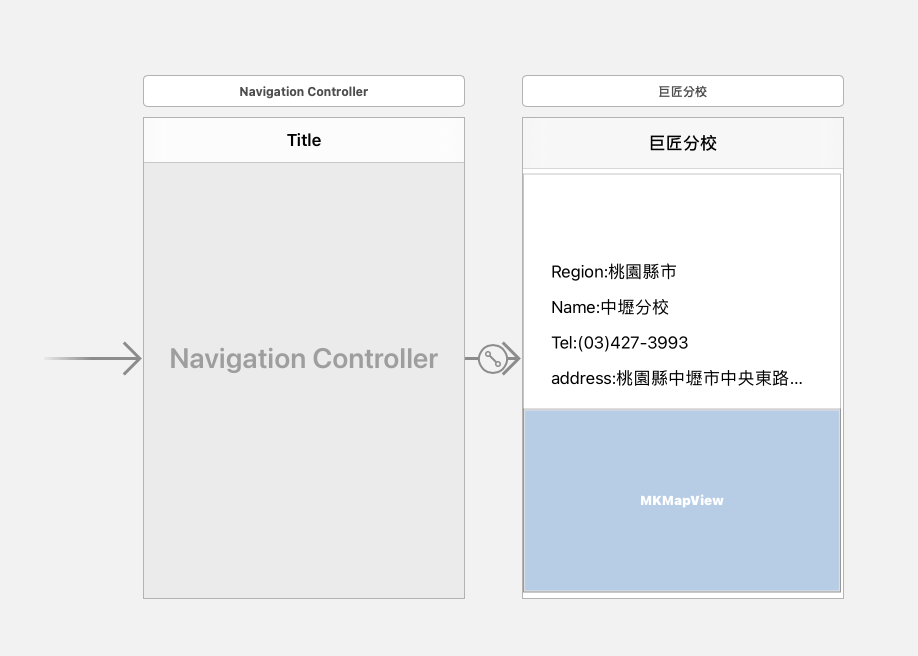

# 解析外部網站下載的json檔
https://flask-robert.herokuapp.com


## SubCollectionViewCell.swift

```swift
class SubCollectionViewCell: UICollectionViewCell {
    @IBOutlet weak var regionLabel: UILabel!
    @IBOutlet weak var nameLabel: UILabel!
    @IBOutlet weak var telLabel: UILabel!
    @IBOutlet weak var addLabel: UILabel!
    @IBOutlet weak var mapView: MKMapView!
}
```

## BranchViewController.swift

```swift
//
//  BranchViewController.swift
//  JSONDecoder_demo
//
//  Created by 徐國堂 on 2017/11/10.
//  Copyright © 2017年 Gjun. All rights reserved.
//

import UIKit
import MapKit

struct AllStation:Codable{
    struct Station:Codable{
        let region:String;
        let name:String;
        let tel:String;
        let add:String;
        let lat:Double;
        let long:Double;
    }
    let allStations:[Station];
}

class BranchViewController: UICollectionViewController {
    var  urlSession:URLSession!;
    var allStation:AllStation!;
    let allStationsPath = \BranchViewController.allStation.allStations;
    
    override func viewDidLoad() {
        super.viewDidLoad()
        let collectionViewFlowLayout = self.collectionViewLayout as! UICollectionViewFlowLayout;
        collectionViewFlowLayout.itemSize = self.view.bounds.size;
        
        //建立連線
        
        guard let url = URL(string: "https://iostest-64ed7.firebaseapp.com/gjun.json") else {
            print("url有問題")
            return;
        }
        urlSession = URLSession.shared;
        let downloadTask = urlSession.downloadTask(with: url) { (url:URL?, response:URLResponse?, error:Error?) in
            guard let url = url, let response = response else {
                print("出錯了1");
                return;
            }
            
            guard error == nil else {
                print("出錯了2");
                return;
            }
            
            guard (response as! HTTPURLResponse).statusCode == 200  else {
                print("出錯了3");
                return;
            }
            
            guard let data = try? Data.init(contentsOf: url) else {
                 print("出錯了4");
                return;
            }
            
            print(String.init(data: data, encoding: String.Encoding.utf8)!);
            
            //轉換json為AllStation的實體
            let jsonDecoder = JSONDecoder();
            self.allStation = try? jsonDecoder.decode(AllStation.self, from: data);
            
            //進入主執行序，要求CollectionView重新載入資料
            DispatchQueue.main.sync {
                self.collectionView?.reloadData();
            }
            
            
         }
         downloadTask.resume();
    }

    
   

    // MARK: UICollectionViewDataSource

    


    override func collectionView(_ collectionView: UICollectionView, numberOfItemsInSection section: Int) -> Int {
        if allStation == nil {
            return 0;
        }else{
            return self[keyPath:allStationsPath].count;
        }
        
    }

    override func collectionView(_ collectionView: UICollectionView, cellForItemAt indexPath: IndexPath) -> UICollectionViewCell {
        let cell = collectionView.dequeueReusableCell(withReuseIdentifier: "Cell", for: indexPath) as! SubCollectionViewCell;
        
        //取得Station的實體
        let station = self[keyPath:allStationsPath][indexPath.row];
        
        cell.addLabel?.text = "地址:\(station.add)";
        
        cell.nameLabel?.text = "分校名:\(station.name)";
        
        cell.regionLabel?.text = "地區:\(station.region)";
        
        cell.telLabel?.text = "電話:\(station.tel)";
        
        //建立MapView和顯示座標內容
        let mapView:MKMapView = cell.mapView;
        
        let annotation = MKPointAnnotation();
        
        let coordinate = CLLocationCoordinate2D(latitude: station.lat, longitude: station.long);
        
        annotation.coordinate = coordinate;
        
        mapView.addAnnotation(annotation);
        
        let region = MKCoordinateRegion(center: coordinate, latitudinalMeters: 250, longitudinalMeters: 250);
        
        mapView.setRegion(region, animated: false);
    
        
    
        return cell
    }

   

}

```

